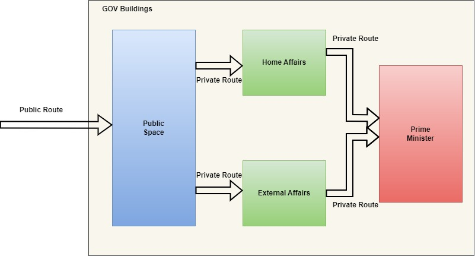

#### What is IP Address?

IPv4 address is a 32 bit binary number divided into 4 octets. each octet consists of 8 bits.

so possible number of IPv4 address = 2^32 = 4.3 billion unique IP addresses

Since these number of not sufficient to server all the computing devices in the world we are using NAT (Network Address Translation). For instance, we are taking broadband connection our ISP will allocate one public IPV4 address. all the devices in the network use same public IPV4 while communicating to the outside world.

Internally modem allocates private IP to each device.

**Private IP Ranges:**  
Private IP ranges are specific blocks of IP addresses reserved for use within private networks and should not be routable on the public internet.

* 10.0.0.0 to 10.255.255.255 (10.0.0.0/8)
* 172.16.0.0 to 172.31.255.255 (172.16.0.0/12)
* 192.168.0.0 to 192.168.255.255 (192.168.0.0/16)

IP Address = Network + Host

#### CIDR Notation
10.0.0.0/8 --> first 8 bits are chosen for Network, remaining 32-8 i.e 24 bits we can use to configure hosts.  
192.168.0.0/16 --> first 16 bits are chosen for Network, remaining 32-16 i.e 16 bits we use to configure hosts.  

AWS cloud CIDR has following rules.
* We can't choose network bits less than 16.
* We can't choose network bits more than 28.

#### What is Network?

N/W where we have a group of computers, servers or any computing devices. It belongs to an entity like home, company, public or private office, etc. It should be completely under our control with tight firewalls, internet connections, inbound and outbound, etc.

We use to divide a network into smaller parts called subnets for better maintenance and security.

